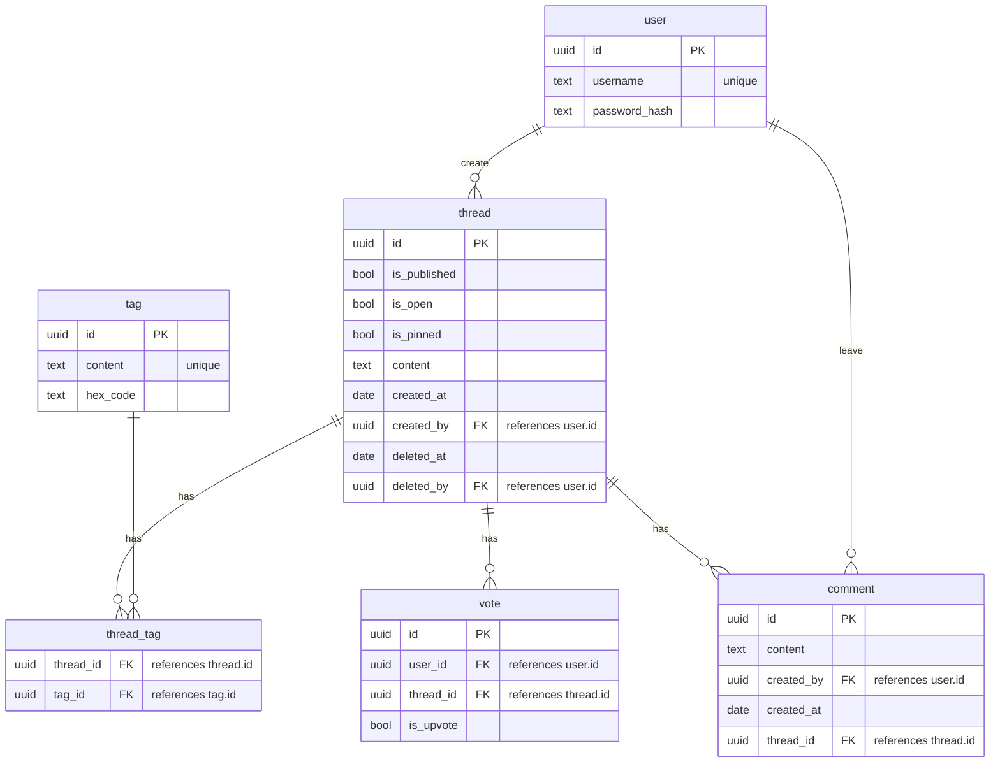

# ERD

```mermaid
erDiagram
  user {
    uuid id PK
    text username "unique"
    text password_hash
  }
  thread {
    uuid id PK
    bool is_published
    bool is_open
    bool is_pinned
    text content
    date created_at
    uuid created_by FK "references user.id"
    date deleted_at
    uuid deleted_by FK "references user.id"
  }
  thread_tag {
    uuid thread_id FK "references thread.id"
    uuid tag_id FK "references tag.id"
  }
  tag {
    uuid id PK
    text content "unique"
    text hex_code
  }
  vote {
    uuid id PK
    uuid user_id FK "references user.id"
    uuid thread_id FK "references thread.id"
    bool is_upvote
  }
  comment {
    uuid id PK
    text content
    uuid created_by FK "references user.id"
    date created_at
    uuid thread_id FK "references thread.id"
  }

  thread ||--o{ thread_tag : has
  tag ||--o{ thread_tag : has
  thread ||--o{ vote : has
  user ||--o{ thread : create
  thread ||--o{ comment : has
  user ||--o{ comment : leave
```
